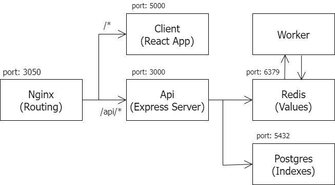
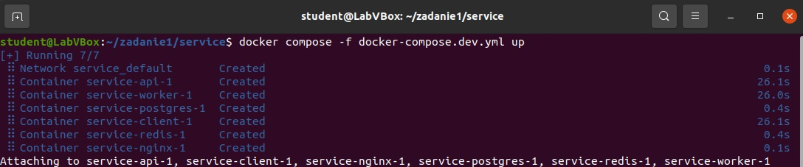
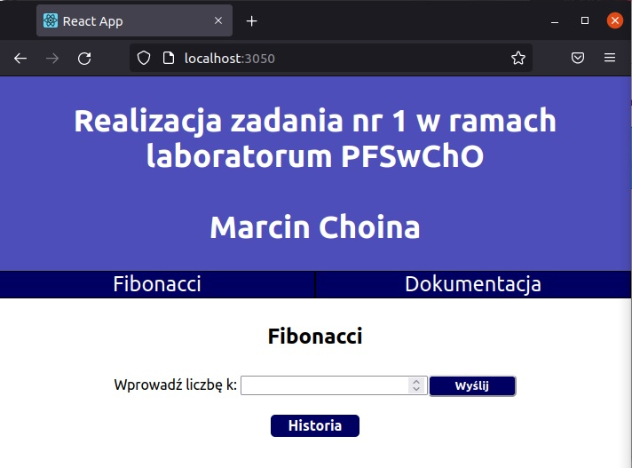
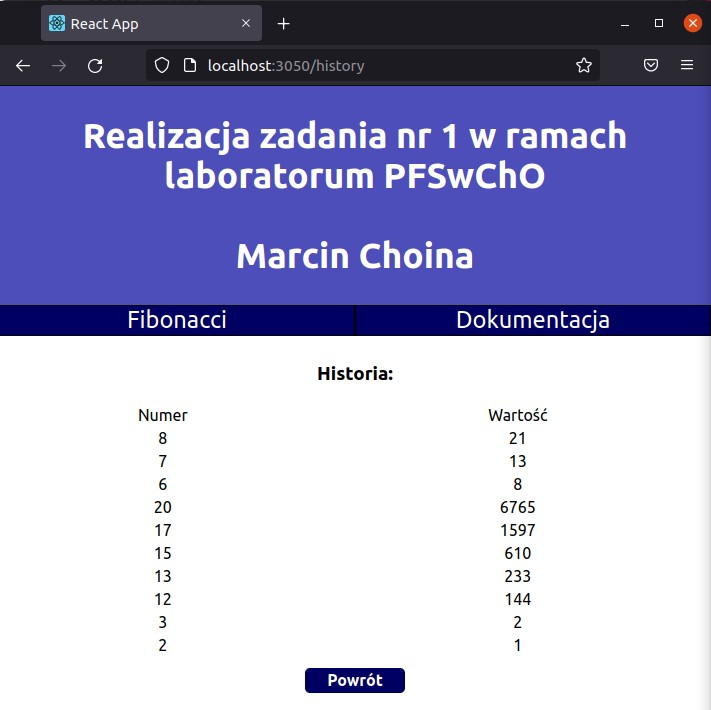
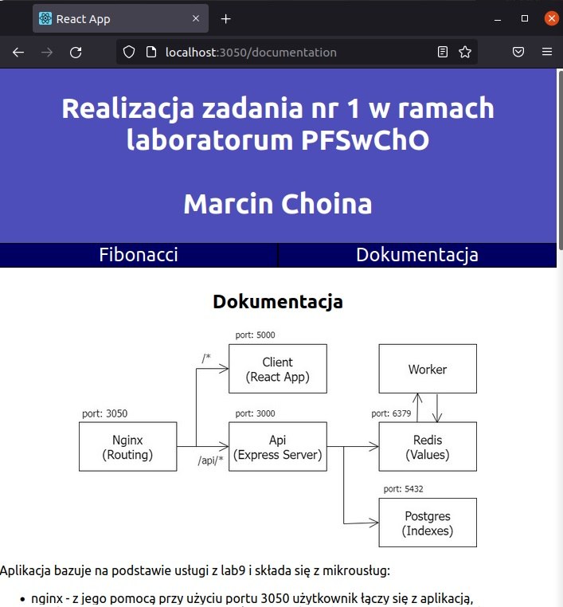

      <h2>Dokumentacja</h2>
      
    

    Aplikacja bazuje na podstawie usługi z lab9 i składa się z mikrousług:
    <ul>
<li>nginx - z jego pomocą przy użyciu portu 3050 użytkownik łączy się z aplikacją, przekierowuje on żądania o ścieżce '/api' do mikrousługi 'api' a pozostałe do 'client'</li>
<li>client - frontend aplikacji, wyświetla główną stronę na której znajdują się odnośniki do podstron 'Dokumentacja' zawierającą opis strony i 'Fibonacci', która pozwala na obliczenie k-tej wartości ciągu fibonacciego oraz wyświetla historię 10 ostatnich wprowadzonych wartości k wraz z obliczoną wartością elementu ciągu. Dane wysyłane i pobierane są za pomocą mikrousługi 'api'</li>
<li>api - łączy się z bazami postgres i redis aby wstawić nowe wartości lub zwrócić pobrane</li>
<li>postgres - przechowuje wszystkie wprowadzone współczynniki ciągu</li>
<li>redis - przechowuje pary klucz-wartość, gdzie kluczem jest współczynnik ciągu, a wartością - obliczona wartość ciągu danego współczynnika.</li>
<li>worker - nasłuchuje nowo wprowadzonych do bazy redis współczynników i oblicza wartości elementów ciągu po czym wprowadza je do bazy</li>
</ul>
    

    

Zmiany
<li>W mikrousłudze dodano własną funkcję obliczającą wartości ciągu utworzoną dla lab8 (worker/fibonacci.js)</li>
<li>Zmieniono strukturę bazy postgres tak aby zawierała indeks ciągu oraz datę dodania elementu</li>
<li>Do api dodano funkcje pobierania ostatnich 10 indeksów z bazy na podstawie daty dodania rekordów</li>
<li>Zabezpieczono api przed dodaniem niepoprawnych indeksów do bazy</li>
<li>W kliencie zmieniono stronę główną, dodano menu i stronę dokumentacji, a także na stronie kalkulatora dodano odnośnik do strony zawierającej 10 ostatnich wprowadzonych wartości k wraz z obliczoną wartością elementu ciągu</li>

Usługę można uruchomić do pracy na etapie rozwoju za pomocą polecenia:  
docker compose -f docker-compose.dev.yml up  
Dostęp do usługi jest możliwy na porcie 3050   

Działająca usługa:

    

